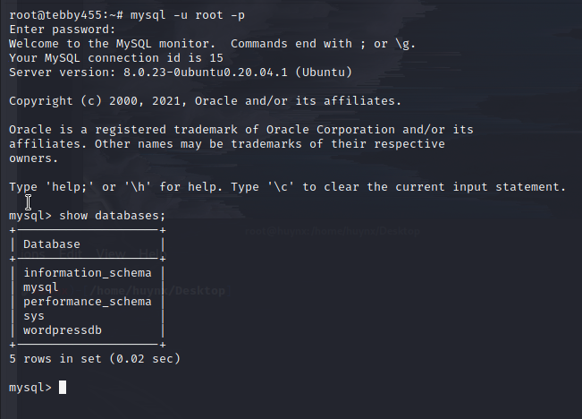

# Install LAMP Stack and LEMP Stack

**What is LAMP & LEMP**
**LAMP** and **LEMMP**based on

**L** stand for **Linux**
**A** stand for **Apache**, with **LEMP**, **E** stand for **Nginx**
**M** stand for **MySQL**, some system it uses **MariaDB**
**P** stand for **php**, some time nowadays it uses **perl**, **python**

- All of these combined into solution for web server more flexible.

## 1. LAMP Stack

a. **Apache2**
> apt-get install apache2 

b. **MySQL-Server**

c. **Configure MySQL-Server**

> login to mysql

> change password for root, by default it is None

d. **Install Wordpress and setup**

> Setup database, if you want to confifure to remote acces, use _'user'@'%'_ instead of _'user'@'localhost'_
> Add _with grant option;_ in the last of line _grant all privileges_

> Download wordpress

> then unzip this file

> Fill Database and Username database like in picture

> Login with your IP, DNS, in here I log in with _tebby455.info/wordpress
> Register username, password, then here is success to log in

> Check apache by `<?php phpinfo(); ?>`

## 2. LEMP Stack

> _apt install php-fpm_ for support Nginx
> _service nginx start_ after installing

> link it into _/etc/nginx/sites-enabled/_

> Check php info again

> Success

***

# Advanced configure 

### 1. Reverse proxy for Nginx

> `cd /etc/nginx/conf.d`

> Create a new file, `nano domain.conf`

> Type these code into file **domain.conf**
> proxy_pass: set your ip, you want to direct to, in here I run two webserver _apache2_ and _nginx_, I use _nginx_ for reverse proxy to direct in _apache2_

> Restart nginx

### 2. Remote MySQL 

> I Created a new Database name: remoteddb

> Create an user in database with password is '123456a@'

> Allow access this user for all IP can connect: _grant all privileges on remotedb.* to 'user'@'%' with grant option;_
> _remotedb.*_ is allowed connect to database **remotedb**, if you allow all databases use `*.*`
> _'%'_ allowed for all IP can connect

> add a comment to line _bind-address_

> Connect Successfully

### 3. **vsftpd**

> _ufw status_ to see all port allowed
> allow port: 20,21,22,40000:50000,990 and OpenSSH by command _ufw allow [port]_

> edit _listen=YES, listen_ipv6=NO_

> Add these line in configure

> Connected

### 4. ***phpmyadmin***

To Install `phpmyadmin`, we install these packages.

> apt-get install phpmyadmin php-mbstring php-gettext –y

> In _php_ version 7.0 to latest, php-gettext will be changed by _php-common_

> In apache2, while installing _phpmyadmin_ you can create database default by dkconfig-common
> Default database is _phpmyadmin_, password you set.

> Symbolic links _/usr/share/phpmyadmin/ /var/www/html_ if you run not found.

> Run it _[your IP]/phpmyadmin_

> login with your database and password

### 5. **Laravel** 

`apt install composer`

`apt install php libapache2-mod-php php-mbstring php-xmlrpc php-soap php-gd php-xml php-cli php-zip php-bcmath php-tokenizer php-json php-pear`

`composer create-project laravel/laravel {dirname}`

> setup database for _laravel_, in here i setup for anyone can remote access to this.

> create a file _laravel.conf_ in _/etc/apache2/sites-available/laravel.conf_ then enanle it by `a2ensite laravel.conf`
> Or you can symbolic link _laravel.conf_

> Open file _/var/www/html/laravel/.env_ edit with your database

> Run command _php artisan serve --host=192.168.111.222 --port=8000_ before go to web.

> Type _[IP]:port_

# Compiling and Installing from Source (Apache & Nginx)

### 1. Nginx

**Install PCRE**

> PCRE is a require module for the NGINX core and rewrite.

> Unzip it by _tar -xvzf [file]_

> locate to File then _./configure_

> make

> make install

**Install zlib**

> zlib - support header compression

> Unzip it by _tar -xvzf [file]_

> locate to file unziped then _./Configure_

> running **Make**

> **Make install**

**Install OpenSSL**

> OpenSSL supports the HTPS protocol

> Unzip it by _tar -xvzf [file]_

> locate to file unziped then _./Configure_

> running **Make**

> **Make install**

**Install Nginx**

> Download stable version of Nginx

`wget https://nginx.org/download/nginx-1.20.0.tar.gz`

> Unzip it `tar -xvzf [file]`

`mkdir  -p /web/nginx`
`mkdir /web/nginx/modules`
`mkdir  /web/nginx/run`

`./configure --prefix=/web/nginx --modules-path=/web/nginx/modules --with-http_ssl_module  --without-http_fastcgi_module --without-http_uwsgi_module --without-http_grpc_module --without-http_scgi_module --without-mail_imap_module --without-mail_pop3_module `

> Then make && make install

> locate to _/usr/local/nginx/sbin_ then _./nginx_ to start service

### 2. Apache

**Install APR & APR-Util**

> This is Apache Portable Runtime is supporting library for the Apache webs server.

1. **APR**

> Download it from source: wget https://mirror.downloadvn.com/apache//apr/apr-1.7.0.tar.gz 

> After downloading, unzip it _tar -xvzf [file]_

Running `./configure --prefix=/usr/local/apr`

> running **Make**

> **Make install**

___

2. **APR-Utils**

> Download it from source: wget https://mirror.downloadvn.com/apache//apr/apr-util-1.6.1.tar.gz

> After downloading, unzip it _tar -xvzf [file]_

Running `./configure --prefix=/usr/local/apr-util --with-apr=/usr/local/apr/`

- If you running then has a problem with expat, do this:

    * Downloading from here: `wget https://github.com/libexpat/libexpat/releases/download/R_2_3_0/expat-2.3.0.tar.gz`
    * `./configure --prefix=/usr/local/expat`
    * `make`
    * `make install`

After this, running `./configure --prefix=/usr/local/apr-util --with-apr=/usr/local/apr/ --with-expat=/usr/local/expat/`

> **Make**

> **Make Install**

___

3. **Apache (httpd 2.4)**

> Download it from source: wget https://downloads.apache.org/httpd/httpd-2.4.46.tar.gz

> Unzip it `tar -xvzf [file]`

Running `./configure --prefix=/usr/local/apache2 --with-apr=/usr/local/apr/ --with-expat=/usr/local/expat/`

> **Make**

> **Make Install**

> Configure apache, because I install nginx and apache running dual, so I have to set port for each, default port of each is 80

`cd /usr/local/apache2/conf/httpd.conf`

> Edit ServerName by your IP if you dont have DNS, add a `#` to ServerAdmin

`cd /usr/local/apache2/bin`
`./apachectl start`

___

### 3. More Configuration

1. **Reverse Proxy**

`cd /usr/local/nginx/conf/nginx.conf`

> Edit file configure like this, replace your server_name and proxy_pass

> When I access to nginx, reverse proxy direct me to apache

2. **vsftpd**

> Allow port

> After adding user, allow acces for it, `chown -R user:user [file]`

> Connected

3. **mysql Remote Access**

> login and change password with 'root' user

> Create a user for remote access

> Add a `#` before line _bind-address_

> Remote successfully

4. **phpmyadmin**

- **Install php**

    * `wget https://www.php.net/distributions/php-8.0.3.tar.gz`
    * Unzip `tar -xvzf [file]`

    * To configure `/configure --with-apxs2=/usr/local/apache2/bin/apxs --with-mysqli --enable-mbstring --with-gettext`, while running if there are any missing packet, you can install with `apt-get`
    * Next `make` and `make install`

    

    > Edit like that

    * Restart apache, `/usr/local/apache2/bin/apachectl restart`
    * To check infophp, create a file `.php` with content `<? php\nphpinfo()?>` in directory `/usr/local/apache2/htdocs/`

- **Install phpmyadmin**

    * Run `apt-get install phpmyadmin`, while running it will require to setup a database with default name: phpmyadmin, password you set.
    * Symbolic links file `/etc/phpmyadmin/apache.conf` to `/usr/local/apache2/conf`, type `ln -s /etc/phpmyadmin/apache.conf /usr/local/apache2/conf`
    * Symbolic link `ln -s /usr/share/phpmyadmin /usr/local/apache2/htdocs/`, because apache2 will run any file in `htdocs`.

    

5. **Install Wordpress**

- **Set up database for Wordpress**

    

    * `wget https://wordpress.org/latest.zip`
    * unzip it `unzip [file`]
    * move file after unzipping to `/usr/local/apache2/htdocs`
    * restart apache then run