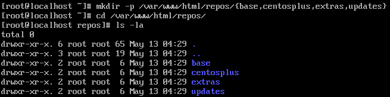

#  CÀI ĐẶT LOCAL REPO TRÊN CENTOS

Trong một hệ thống nội bộ, việc cài thêm những gói package với các phần mềm, công cụ để hỗ trợ trong việc làm cụ thể của một Công ty thường xuyên xảy ra. Để đồng bộ các máy tính làm việc, ta cần có một hệ thống đã setup những packet của các phần mềm, công cụ cần thiết. Việc này giúp cho các máy tính có thể download cái phần mềm, công cụ trong mạng nội bộ, đạt được tốc độ cao hơn so với kết nối ngoài, giúp cho những người không biết gì về việc download các phần mềm, công cụ open-source.

# 1. Chuẩn bị

1. **Máy 1 dùng để làm webserver:** 
- Hệ điều hành: CentOS (version nào cũng được)
- Địa chỉ IP: 192.168.111.
- Đã được cấu hình Web Server Apache (Nginx), tham khảo tại <a href='https://blog.vietnix.vn/zero2hero-5-cai-dat-va-cau-hinh-web-server-apache.html'>đây</a>
  
2. **Máy 2 dùng để làm Cilent: được dùng để kiểm tra và download thử repo của server**
- Hệ điều hành: CentOS (version bất kì)
- Địa chỉ IP: 192.168.111.110

# 2. Cài đặt

1. **Cài đặt trên máy chủ:**

- Cài đặt phần mềm để tạo một vùng lưu trữ repomd từ rpms.
`$ yum install createrepo` 

- Cài đặt công cụ để thao tác `repo` và quản lí packet mở rộng
`$ yum install yum-utils`

- Tạo thư mục `repo` trong `/var/www/html/` bao gồm các thư mục con: base, centosplus, extras, updates
`$ sudo mkdir –p /var/www/html/repos/{base,centosplus,extras,updates}`


- Tiếp theo mình sync các repo cơ bản về
`$ sudo reposync -g -l -d -m --repoid=base --newest-only --download-metadata --download_path=/var/www/html/repos/`
* `-g` xóa package nếu như xác nhận GPG thất bại sau khi download
* `-l` bật hỗ trợ yum pugin
* `-d` xóa local packet mà không còn lưu trữ trong repo
* `-m` download cả tập tin comps.xml

    

- Tương tự với centosplus, extras, update
    ```
    $ sudo reposync -g -l -d -m --repoid=centosplus --newest-only --download-metadata --download_path=/var/www/html/repos/
    $ sudo reposync -g -l -d -m --repoid=extras --newest-only --download-metadata --download_path=/var/www/html/repos/
    $ sudo reposync -g -l -d -m --repoid=updates --newest-only --download-metadata --download_path=/var/www/html/repos/  
    ``` 

- Sau khi chờ download xong hết, thực thi lệnh
`$ sudo createrepo /var/www/html`

- Restart lại webserver
`$ service httpd restart`
- Lên web kiểm tra thử `http://192.168.111.111/repos`
    

2. **Cài đặt trên Client:**

- Tạo một tập tin .repo
`$ sudo nano /etc/yum.repo.d/local.repo`

- Thêm những dòng sau đây:

    ```
    [local.repo]
    name=[Optional]
    baseurl=http://192.168.111.111
    enabled=1
    gpgcheck=0
    ```
- Để kiểm tra hoạt động, ta cần bỏ hết .repo hiện đang có
`$ sudo rm /etc/yum.repo.d/*.repo`

    
- Kiểm tra thử cài đặt