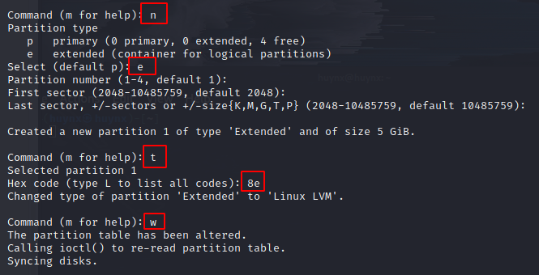

# Lab 1

## Task following <a href='task4.txt'>here</a>

1. **Create LVM Disk**

- Logical Volume Manager (LVM) is a technical to manager hard disks, easy to expand or modify size of disk.
- It is easy to manager disk, but setting steps is flexible and if you are running in dual-boot, this OS cannot access to other OS disk.

    1.1 **When installing OS**
    - First, add another disk in OS

    
    > I add more two disk in OS, one for set LVM while installing OS, other for add in LVM exist before while finishing install OS.

    
    > Choose custom storage layout

    
    > Setting LVM with 1 disk, another disk use to boot
    > Next installing keep in default then next until finish

    1.2 **Add a Disk to a LVM group existing**

    - `fdisk -l` to check existing disk in your computer.

    
    > You will see a disk has not partition yet.

    

    - `fdisk /dev/sdc` to partition disk
    - choose `n` for create a new partition
    - choose `e` for extended type

    > Next, I keep in default setting until finish

    - choose `t` for change type
    - type `8e` which mean LVM linux
    - choose `w` to write on table partition

        

    - `fdisk -l` again you will see a partition created `sdc1`
    - Next, create a physical volume (PV) `pvcreate /dev/sdc1`
    - extend LVM group `vgextend vg0 /dev/sdc1`
        * `vg0`: name of your LVM group

        

        
        > Check LVM group after extend, you will see line `Free PE/ Size`

    - Next, create a Logical Volume (LV)

        
        > I add a LV data2 with 4.99G, because your free space < 5G so you have to add with less than 5G

    - Format LV to ext4 format

        

    - Finally, mount the file system
        
        
___

2. **Control panel**

- Access website *vestacp* <a href='https://vestacp.com/install/'>here</a>

> choosing your options then it shows command line for installing
> you must install vestacp with a clean machine, which means has not installed anything relate to it.

> fill your information then waiting

> finish, remember your **username and password**

> In here you can create more anything you want to.

2.1 **Upload Wordpress**
- to upload source Wordpress, locate to dir `cd /home/admin/web/DNS/public_html`
- download source from wordpress `wget http://wordpress.org/latest.tar.gz`
- `rm -rf robots.txt index.html` two file are exist before on this dir
- `cp -rv wordpress/* /home/admin/web/DNS/public_html`
- `cp wp-config-sample.php wp-config.php`

> Create database in vestacp

- `nano wp-config.php`

> Next, go to your website to install

> after installing, login with your **username** and **password** you created

