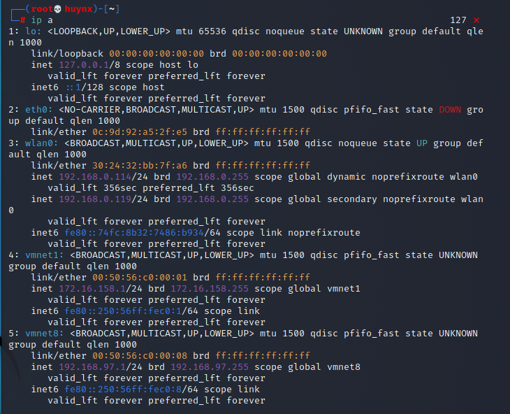

# Linux System Fundamentals

 Nowadays, Linux (an operating system distributed under an open-source license) is becoming popular for providing a platform which developers could intervention to a system, a network server. Almost IT professionals with or no Linux experience they can be approached to. Linux provides a role better than other OS like Organizing, Managing and Operating a server, also services in Information Systems, secure for environment, solutions, ... for personal, organization and enterprise, ... Here is my report for basic and fundamentals in Linux.

***

## Outline 

<a href='#Section1' style='text-decoration: none'>I. Linux Session</a>

<a href='#Section2' style='text-decoration: none'>II. Process Control</a>

<a href='#Section3' style='text-decoration: none'>III. Basic Command line with Linux</a>

<a href='#Section4' style='text-decoration: none'>IV. Text Editing Tools</a>

<a href='#Section5' style='text-decoration: none'>V. Filters</a>

***

#### I. Linux Session

1. **Checking Information of a Linux system**

	- Checking information of a system is a important thing you have to know, specially when you are working with server. More information you know, more success you work for your project.

	a. Checking CPU: By default in Linux OS, you can check CPU Information by `lscpu` command.
		

	b. Checking RAM: to check memory for easy working, running suitable program, avoid unecessary program, for developers, they have to consider for coding.
  	- 1. Using `free [OPTION]`

		* Ex: use `free` for normally checking RAM

			
		* [OPTION]: In this common command [OPTION] are used is defind output in specific unit (`-k` kilobytes, `--mega` megabytes, ...)
		* Other, there is command `free -t` to show all memory(RAM) and swap.

	- 2. Using `cat /proc/meminfo`: This is command to show full detail of Memory information.

	c. Checking network: to check network interface, also IP, subnet mask, gateway, broadcast, ...

	- Basically checking network by `ifconfig` if you installed **net-tools**, if not use `ip a` means **ip address**

		* `ip a`

		

		* `ifconfig`

		

	- `netstat [OPTIONS] <socket>` 

		* Tool for follow all of network connection output and input in system. It is useful for solving problem in network. 
		* Common [OPTIONs]:

			* -r: show routing table
			* -i: show interface table
			* -o: display timers
			* -a: show all sockets

			
2. **Users and access permission of users**

	- ***Users***: There are accounts that you create in Linux, it relates to use ***_username_*** and ***_userID_***

		* ***Username***: It often uses to login, provide permission, ... but in Linux, system works in ***UserID***
		* ***UserID***(User identifier): A number go with ***username***, OS uses this number to manage.If two users have different name but have the same UID, these are still in one user. In Linux, to check UID, it stores in ***/etc/passwd***, use `cat /etc/passwd`

			
			
	- ***Access Permission***: In Linux, permission of users divide into 2 permission:

		* ***root***: If users have ***root*** permission, those users can be accessed anything in system. These are called ***superuser***, have an userUID=0.
		* ***normal***: It means that users have userUID#0, oftenly users that clients create a new user in system. These are work in permission of ***user with root permission***. 

3. ___Checking current Disk usage *df command*___
  a. ***df*** command
    - Showing the amount of disk space used and size available on Linux file System.   
    
 	 b. ***Syntax***: df [OPTION] ... [FILE] ...
  	- ***Example***: 
      * Show all of current disk in System: `df [Enter]`
      * Show a specific file/folders: `df -a /dev/sdb1`: there is will show | Filesystem | 1K-blocks | Used | Available | Use% | Mounted on.
    - [FILE]: Like in Example, my file is ***/dev/sdb1***
    - ***Common*** [OPTION]:
      * -a, --all: show all file systems, include hidden files.
      * -h: show block Size in power of 1024 (ex: 1024M)
      * -H: show block Size in power of 1000 (ex: 1.1G)
      * --total: show a sum of all of disk (ex: I have 2 disk 100G of each, there is will show a line total is 200G)
      * -T: show a file Type (ex: I partition disk to store data is /dev/sda4, it is ***a ext4 type***
3. ___Checking summarize disk usage of the set of FILEs *du command*___
	a. ***du command***
    	- Showing disk usage then estimate for space usage. For example: I have disk A with size is 100GB, I use command, it shows that my Disk A used 2GB, for that I               could estimate space usage of Disk A.  
  	b. ***Syntax***: du [OPTION] ... [FILE] ... (recommended to use)
    or: du [OPTION] ... --file0-from=F
    - ***Example***: 
      * When you are in specific folder, ex., you are in ***_/home/name/Downloads_***
      * Use: `du [ENTER]`, there will show all of file that folder contains and their size
      * `du -a _/home/name/Downloads_`: show all of file and size that you choose, in here I choose check in _/home/name/Downloads
      * `du -a _--file-from=/dev/sdb1_`: summarize disk usage of the Disk, in here I check in disk _/dev/sdb1_.

	- ***Common*** [OPTION]:

	* -a, -all: show all file in directory
	* -h: show size of files that human readable format (ex: 1K, 1M, 1G,...)
	* -c: show total size file in directoryrecursively
	* -d + [number]: show the total level for a directory (ex: my [number] is 1, I am in ***/home/name***, it will show ***/home/name/Downloads***, if number is 2 it shows ***/home/name/Downloads*** and ***/home/name/Downloads/Telegram***)
	* -s: show only total of directory

4. **Checking Disk Partition**

	a. ***fdisk*** command
	
	- **fdisk** is the most common used command to check the partitions on the disk. It displays the partition and details like file system type, but it does not report size in unit of each partitions. Other, **fdisk** can be used in partition disk or change many thing on disk.
	- **Syntax** 

		* `fdisk [OPTION] <disk>` change, edit partition disk
		* `fdisk [OPTION] -l <disk>` list partition table of disk
			
			> This is command for show all of partition of disk that are in your computer
		* If you want to show specific of disk, ex: `fdisk -l /dev/sda1`

	b. **`df command`** this command can be used to check partition 
		

	c. Mount and Umount

	- **Mount:** Allow computer access to I/O storage device like USB and hard drive. 

		* __Syntax__: `mount [OPTIONS] device dir` or `mount [OPTIONS] device|dir`
		* Common [OPTIONS]

           * -l: List all the file systems mounted file
           * -h: help, display full options
           * -V: show version of `mount`
           * -a: mount all filesystems mentioned in fstab
           * -t: type of filesystem device uses
           * -r: set read-only to file mounted

		* Example: `mount -l -t ext4` to list all mounted file that are using type **ext4**

			

	- **Umount:** When you finish working with any divice that you mounted, you have to umount it to avoid data missing.

		* __Syntax__: `umount [OPTIONS] <source> | <directory>`
		* Common [OPTIONS]

			* -a: unmount all filesystems
			* -r: if unmounting fail, that disk will be remount in read-only
			* -t: tyoe of filesystem device uses
			* -f: force to unmount

		* Example: `mount /media/dirname`, if output does not appear anything, it success.
			

_ _ _

### II. Process Control

1. **Overview**

	- Process control is a technical to follow time by time the process activities. Managing and resolving problems in operation of process. In each processes, these are have Process ID(PID). There are two type of process: **Foreground Process** and **Background Process**

		* __Foreground Process:__ Every processes that you run interactively in your shell are Foreground Process. If a process have a while to run, you have to wait and cannot do anything until it finishs or you interupt it by `CTRL Z`. Example: I `ping 8.8.8.8`, it will run after 5 times ping _icmp_seq_ for Windows, for Linux it will continue until you `CTRL Z`, in while it is running you cannot do anything.
		* __Background Process:__ Every processes that you run, it does not interact with your shell directly. You can run other process while Background Processes are running. Example: I run `sudo`, it will run in system, to stop it `exit`

			

2. **Viewing process status __`top`__**

	- In Linux, to display all process in real-time view of a running system, use `top`. It could be display system summary information as well as list of processes or threads.
	- __Syntax:__ `top [OPTIONS]`

		* Common [OPTIONS]: 

			* -e: k(kilobytes) | m(megabytes) | g(gigabytes) | t(terabytes) | p(pebibytes): Enfoce task memory scaling
			* -E: k(kilobytes) | m(megabytes) | g(gigabytes) | t(terabytes) | p(pebibytes): Enfoce sumary memory scaling
			* -s: use in secure mode

		
		> PID: process id
		> PR: priority of the task
		> NI: Nice Value of task, positive NI means lower priority, negative means higher priority
		> VIRT: virutal memory used
		> SHR: shared memory size
3. **Kill a process**

	- `kill <PID>` when you install a tool, but it has conflict with PID(ex: PID=111), so you have to kill it if it does not affect with running system.
	-  Example: kill a process with PID is 10, `kill -9 10`, _-9_ is shutdown immediately.
___

### III. Basic command line with Linux

1. **Working with directories**

	a. __`pwd`__

	- `pwd` print name of current/working directory. For the old Linux OS, this command was helpful for people who working in Linux.

		
		> Common used in _pwd_

	b. __`cd`__

	- `cd` change your current direcotry to _/root_ directory

		

	- More options in cd: 

		* __Syntax:__ `cd <path dir>`
		* `cd ..` go to the parent directory
		* `cd -` go to previous directory

	c. __`ls`__
	- `ls` list the content of a directory
	- __Syntax:__ `ls [OPTIONS] <path dir>`

		* By default, use _ls_ for current directory, if you want to list other directory, you can use `ls [OPTION] <path dir>`, ex: `ls -a /home/huynx/Desktop`
		

		* Common [OPTIONS]

			* -a: to show all hidden files
			* -l: to display the content in different format
			* -h: to show the number of size in human readable format

			
			> Different between _ls_ and _ls -l_

	d. __`mkdir`__

	- `mkdir` to create a new directory. Common used to create `mkdir mydir`
	- __Syntax:__ `mkdir [OPTIONS] dirname`
	- Common [OPTIONS]:

		* -p: to create a parent directory, for example: `mkdir -p mydir1/mydir2/mydir3` it will be created _mydir1_ then _mydir2_ in _mydir1_, ... 

			

	e. __`rmdir`__

	- `rmdir` to delete direcoties if they are empty
	- Example: I used `rmdir` to delete ***mydir*** that I created before

		
		> I can not delete because in _mydir_ it has other directories

	- In order to delete by `rmdir`, also use `rm (remove dir)` it can deleted directories that have content inside and common [OPTIONS] is `-rf`

2. **Working with files**

- Directories is a special kind of file. 
	a. __`locate`__

	- `locate` to search a file, or search by file type
	- Basically, search a file without any options `locate task.txt`

		

	- If you do not remember name of file, just know file type, use `locate *.txt`, this command show all file with type is _.txt_

	b. __`cp`__

	- `cp` to copy file(s)
	- **Syntax:** `cp [OPTIONS] SOURCE DEST `, copy SOURCE to DEST or multiple SOURCE to DEST

		* In current directory, I copy a file into two, `cp hello.txt hello1.txt`

			

		* Copy a file forward to another directory, `cp hello.txt /home/name/Desktop/hello.txt`
		* To copy multiple SOURCE to DEST, `cp task1 task2 task3 /home/name/Desktop/`, last argument must be a dricetory
		* -i: if you want to overwrite file that existing

	- Do the same with directories

	c. __`mv`__

    -  `mv` to move file(s)
	- **Syntax:** `mv [OPTIONS] SOURCE DEST/DIR `, rename SOURCE to DEST or move SOURCE to DIR

		* Can rename with `mv`, `mv hello.txt aloha.txt`

			

		* To move a file `mv aloha.txt 
			

3. **Working with file contents**

	a. __`head`__ 

	- `head` to display first ten lines of a file

		

	- If you add _-[number line]_ `head -4 task.txt` there will show first 4 lines.

	b. __`tail`__
	- `tail` to display last ten lines of a file

		

	- If you add _-[number line]_ `head -4 task.txt` there will show last 4 lines.

	c. __`cat`__

	- `cat` command is one of the most universal tools. It uses display a file on the screen without editor.
		

	- `cat` also to use create files, `cat > hello.txt`

	d. __`more and less`__

	- `more and less` used to display file that take up more than one screen like your screen not enough to contain all of content. Users use space bar to see the next page, **q** to quit. `more and less` are the same uses but lightly different format.

		

	___

## IV. Text Editing Tools
   - In Linux, almost Text Editor can be used for developer, coding with better efficiency than compiler.

1. **Vim Editor**(best for Ubuntu)

    - **Vim editor** a tools famous in text editor with many shortcut keys, running fast, but not easy to use for beginers. 
    - To run **vim**, `vim`, run it with create a file `vim hello.txt`

2. **Vi Editor**(most primitive editors in Linux)

	- To run *vi editor*, `vi`, or create a file `vi hello.txt`
	- _vi_ have 2 basics mode: _insert_(allow user can write), _command_(user only use commands in this mode)
	- There is some commands that useful for use _vi_:

		* :w	Write this file out
		* :q	Quit _vi_ w/o writing
		* :q!	Force quit _vi_ w/o writing
		* :w!	Force write
		* :wq	Write then quit

3. **Nano GNU Editor**

	- This is a text editor which for users easy to use, also popular in Unix and Linux.
	- To run _nano_, `nano`, to create a file `nano hello.txt`

		

___

## V. Filters