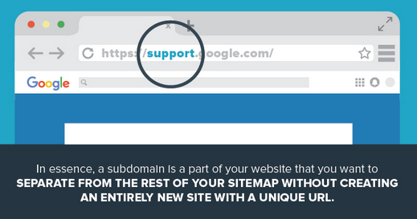

# Overview Server

With a modern society, technology is becoming popular over the world, any Company, Organization, Enterprise, ... are need a system information. For operation and managing this system information, they have to use a server to do these works. All of machines, computer in Company, Organization, Enterprise, ... is managed by server for security, also easy to transfer files.

***

## Outline

<a href='#Section1' style='text-decoration: none'>I. Server</a>

<ol>
    <li><a href='#Section1.1' style='text-decoration: none'>What is Server? </a>
    <li><a href='#Section1.2' style='text-decoration: none'>Types of Server</a>
</ol>

<a href='#Section2' style='text-decoration: none'>II. Web Server</a>

<ol>
    <li><a href='#Section2.1' style='text-decoration: none'>Web Server </a>
    <li><a href='#Section2.2' style='text-decoration: none'>Web Server popular nowadays</a>
    <li><a href='#Section2.3' style='text-decoration: none'>Secure Sockets Layer (SSL)</a>
</ol>

<a href='#Section3' style='text-decoration: none'>III. Domain</a>

<ol>
    <li><a href='#Section3.1' style='text-decoration: none'>What is Domain? </a>
    <li><a href='#Section3.2' style='text-decoration: none'>Domain Name System (DNS)</a>
</ol>

<a href='#Section4' style='text-decoration: none'>IV. Proxy Reverse</a>

<a href='#Section5' style='text-decoration: none'>V. Demontration</a>

___

### I. Server

1. **What is a Server?**

- Server is a machine has function provide information or storing of a clients, when they upload or download. This is a topology Client-Server.

- Example: In model Client-Server, at least we have 2 machine, I call A and B. If I use machine A to install application like web-server, database-server for providing machine B allow acces and use my data. So machine A is a server, machine B is a client.
    

2. **Type of Server**

    a. **Dedicated Server** 
    - A server is hosted by a company, an organization, an enterprise, ... and allow  only one user, customer hire, dedicated to one client, not shared to any customer.
    - Sometime, with Services Provider, they separate resources in their server to smaller storage, it called **Hostings**

        * __Hosting:__ uses to store data of website, mail server, FTP, ... If not your website only works in local. With _hosting_ anyone can search, access to if you have a domain or specific IP Address.

            * __Type of Hosting__:

                1. **Shared Hosting**: Is a Hosting service that can be separated smaller for many websites. Many resource of many website can be stored in one hosting server. In this service, it cost lower, easy to build with, but you have less permission to access system and when other website use same your shared hosting have many access to it, your website will be slowed.

                    
                2. **Dedicated Hosting:** Is a physical Server of yours, all of resources are yours. Flexibility to permit in server. In fact, _dedicated hosting_ is the same with _server_, so that the price not cheap. 

                    
                3. **VPS hosting:** Solution between _Shared hosting_ and _dedicated hosting_, a physical server is created by virtualization to create more virtual server.

                    

    b. **Virtual Private Server(VPS)**
    - A server is seperated to many virtualization servers, it call **VPS**. In each, _VPS_ are the same with Server and running with shared resources. In each _VPS_ contains many _VPS Hosting_.

    c. **Cloud Server**
    - **Cloud Server** is a server which developed based on _Cloud_. It has better performance than_VPS_ and flexible. **Cloud Server** can serve with many website has high rate access.

        

___

### II. Web Server

1. **Web Server** is mean a large Systems/Computers is connected together to an extensive set of network conputers.

- **Web server** can be known in _Physical_ and _Software_:

    a. **Physical** 
    - **Web Server** is a computer that store images, data in HTML, CSS, JavaScrip of a website, provide service to End-user (Client).

    b. **Software**
    - **Web Server** redirect users to its data to HTTP server. HTTP server is a software that can be understand all of website URL and protocols for use these website.

2. **Web Server popular nowadays**

    a. **Web Server Apache**

    
    - _Web Server Apache_ is a open-source software for _Web Server_, support almost OS like _Unix, Linux, Windows, Mac OS,..._
    - A software for setting and connecting between server and browser for Client(End-User). *Apache* has a highly customizable modular platform, use _thread_ architecture so that it can be had problem in efficient, allow _Administrator_ can be disable, add more module. Specially, _Apache_ has module for caching security, URL rewriting, authenication password, ... 

    b. **Web Server Nginx**
    
    
    - *Nginx* is a open-source software for web server, use asynchronous event-driven architecture. This is a software for server has a highly speed and large extend, can be executed in a large connection in the same time. Famous web-servers nowadays use it like *Google, Adobe, Netflix, ...* 
    - *Nginx* has almost function in *Apache*, also *Nginx* be better than *Apache* by speed execution, use memory server efficiently. Resource for *Nginx* used less in a large execution.

3. **Secure Sockets Layer (SSL)**

- To secure between connection in server and clients with more personal and Integrity, **SSL Standard Protocol* was appeared for Security Technology, Encrypt communication connection between Server and Client.
- Some common definitions and terms of SSL:

    a. **Certificate Authority (CA)**
    - **CA** is a organization for providing digital certificate to customer, Enterprise, Server, Coding, Software. **CA** is a third role, which support for safety exchanging.

        
        > With *SSL(CA)* _http_ change to *https*, *s* stand for **Security**

    b. **Domain Validation(DV SSL)**
    - **DV SSL** is a digital certificate for Domain Name - Website. **DV SSL** gives that Domain more reliable while exchanging data.

        

    c. **Organization Validation (OV SSL)**
    - **OV SSL** is a digital certificate for Website and confirm that Organization owned this Website.

        

    d. **Extended Validation (EV SSL)**
    - **EV SSL** to show Website have the highest security and trust for customers.

        

    e. **Wildcard SSL**
    - **Wildcard SSL** is spent for Website has many different subdomain. With _Wildcard SSL_ allow running in many subdomain and domain website.

        

    f. **Subject Alternative Names (SANs SSL)**
    - **SANs SSL** security for only one Domain has been accredited before. **SANs SSL** has more secure than **Wildcard SSL* and reduce cost for deploying all of domain and server if neccessary.

  > To recognize a website has SSL or not, we check in the URL of website, we can see _http_ or _https_ and has a green check for SSL and red check for not.

- Why the website use SSL? 

    * Using for security in website 
    * For copyright website in organization or enterprise, ...
    * Having trust for customers when they access to the website.

___

### III. Domain

1. ***What is Domain?***
   - _Domain_ is a website address which people usually type it in URL bar to access website, it is typed in _IP Address_

        
        > I can access to _Google.com_ with IP Address is 172.217.161.174

    - _Domain_ defines your indentity, so that every enterprise, company, organization also have a domain if they are in the Internet. Managing, operating your own website and for more professional.

        

    - **Top level Domain (TLD)**

        * __TLD__ is the highest domain, a extended part in behind _yourDomainName_. Popular is `.com`, `.org`, `.edu`, ... **TLDs** are manged by an Organization called Internet Assigned Numbers Authority (IANA), to view all of _TLD_ <a href='https://www.iana.org/domains/root/db' target="_blank">here</a>
        * __TLD__ separated into 2 type: __TLD__ for countries (ccTLDs), __TLD__ for global (gTLDs)

            * __Country-code Top level Domain__ to defines for a sepcific country. Example, `.vn` for **Viet Nam**, `.us` for **United States (America)**, ...
            * __Generic Top level Domain (gTLDs)__ Independance for any Country, purpose for not only specific using like for Education is `.edu`, but also for everyone using like `.com` not using for _commercial_

    - **Sub Domain**

        * **Sub domain** which created by webmaster after building to separate each services in webserver.

            

2. ***Domain Name System (DNS)***

     - **DNS** is a system for exchanging _Domain_ to format like `www.domain_name.com`. Example, instead of you will remember _IP Address_ of _Google.com_ is 172.217.161.174, you just remember that _DNS_ is _Google.com_

        

    - **Common DNS record**

        * **CNAME Record**: Allow you to create a new name, point to the default name then set TTL (Time to live). Summary, to create manys name in domain, use this record (CNAME).
        *  **A Record**: This record is popular to point to a Website with specific IP Address. This is a basical record.

            
        *  **MX record**: With this record, you can point from Domain to Mail Server, set TTL, priority. **MX record** point to which Server manage which Email service of DNS.

            

        * **AAAA Record**: To point to a website whit IPV6 Address, need to use **AAAA record**. 
        * **TXT Record**: Adding `txt` value, new host, Points To, TTL for containing information with text type of Domain.
        * **SRV Record**: Defining exactly which services use which ports. This is a special record, you could add more name, priority, port, weight, TTL, Points To.
        * **NS Record**: With this record, you can point to specific Name Server for each subdomain. 

    - **Types of DNS Server**

        * __Root Name Server__: A DNS Server contain information to search other authority for top-level-domain

            

        * __Local Name Server__: A server contain information to search DNS stored for lower level domain. It is usually maintained by enterprise, or Internet provider (ISPs).

            

    - **DNS Operating Principles**

        

___ 

### IV. Proxy Reverse

1. ***What is Reverse Proxy***

    - **Reverse Proxy** is a proxy intermediaries between a server and clients. Checking all request of clients, if valid it will be exchanged to suitable server. **Rverse Proxy** usually deploy to support increase security, efficiency and reliable.

        

2. ***Benefits of Reverse Proxy***

    - **Security**: By blocking requests from being sent to your backend server, the reverse proxy server protects our identity and acts as a safeguard against security attacks. With a reverse proxy server a website or service will never reveal the IP addresses of the original servers. This makes these attacks difficult to execute.

    - **Balance downloading:** If many servers run the same application, _Reverse Proxy_ can distribution with the same for each server.

***

### V. Demontration

<!-- 1. ***SSL Certificate Authority for HTTPS in local***

    
    
    
     -->

1. **DNS Server**

    
    > Install bind9

    ]
    > Create a forward zone in `/etc/bind/named.conf.local`

    
    > Also in that file, add more reverse zone.

    
    > Copy a file _db.local_ to _foward.tebby455.info.db_, also in reverse

    
    > Edit like in picture

    
    > Edit like in picture

    
    > Check configure, if did not show anything, it is success

    
    > Check _named-checkzone_ both 

    

    

    

2. **Reverse Proxy**

    
    > Locate to file name _/etc/apache2/site-available/Apache2Proxy.conf_ configure like picture
    > Copy it into directory _/etc/apache2/site-enable/_, because apache run based on _site-enable_
    
    > Turn on **proxy** `a2enmod proxy`
    > Turn on **proxy_http** `a2enmod proxy_http`
    > Restart apache to activate `systemcl restart apache2` or `service apache2 restart`
    Bingo

***

<a href='https://github.com/tebby455/My-Report/blob/main/README.md' tyle='text-decoration: none'>Come Back</a>