# Install LAMP Stack and LEMP Stack

**What is LAMP & LEMP**
**LAMP** and **LEMMP**based on

**L** stand for **Linux**
**A** stand for **Apache**, with **LEMP**, **E** stand for **Nginx**
**M** stand for **MySQL**, some system it uses **MariaDB**
**P** stand for **php**, some time nowadays it uses **perl**, **python**

- All of these combined into solution for web server more flexible.

## 1. LAMP Stack

a. **Apache2**
> apt-get install apache2 

b. **MySQL-Server**

c. **Configure MySQL-Server**

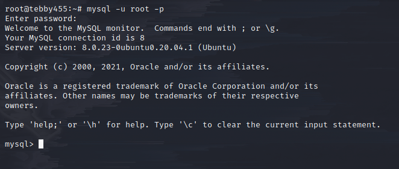
> login to mysql

> cahnge password for root, by default it is None

d. **Install Wordpress and setup**

> Setup database, if you want to confifure to remote acces, use _'user'@'%'_ instead of _'user'@'localhost'_
> Add _with grant option;_ in the last of line _grant all privileges_

> Download wordpress

> then unzip this file

> Fill Database and Username database like in picture

> Login with your IP, DNS, in here I log in with _tebby455.info/wordpress
> Register username, password, then here is success to log in

> Check apache by `<?php phpinfo(); ?>`

## 2. LEMP Stack

> _apt install php-fpm_ for support Nginx
> _service nginx start_ after installing

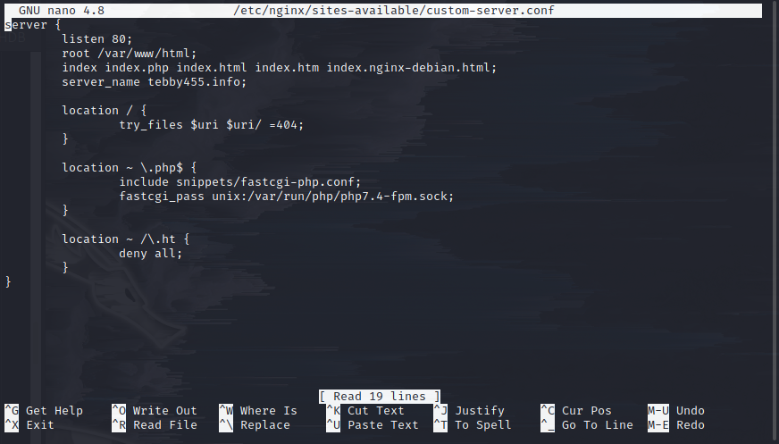

> link it into _/etc/nginx/sites-enabled/_

> Check php info again

> Success

***

# Advanced configure 

### 1. Reverse proxy for Nginx

> `cd /etc/nginx/conf.d`

> Create a new file, `nano domain.conf`

> Type these code into file **domain.conf**
> proxy_pass: set your ip, you want to direct to, in here I run two webserver _apache2_ and _nginx_, I use _nginx_ for reverse proxy to direct in _apache2_

> Restart nginx

### 2. Remote MySQL 

> I Created a new Database name: remoteddb

> Create an user in database with password is '123456a@'

> Allow access this user for all IP can connect: _grant all privileges on remotedb.* to 'user'@'%' with grant option;_
> _remotedb.*_ is allowed connect to database **remotedb**, if you allow all databases use `*.*`
> _'%'_ allowed for all IP can connect

> add a comment to line _bind-address_

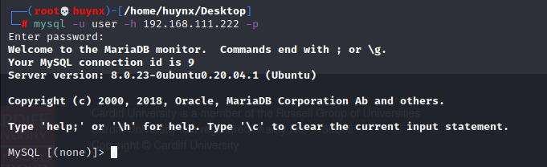
> Connect Successfully

### 3. **vsftpd**

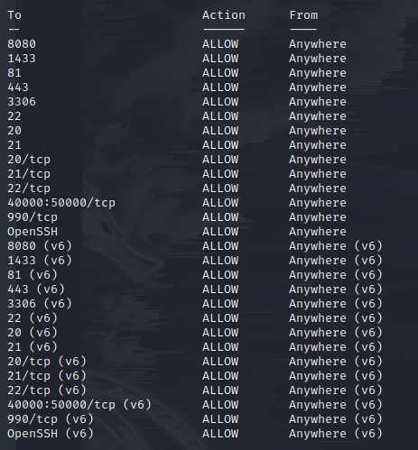
> _ufw status_ to see all port allowed
> allow port: 20,21,22,40000:50000,990 and OpenSSH by command _ufw allow [port]_

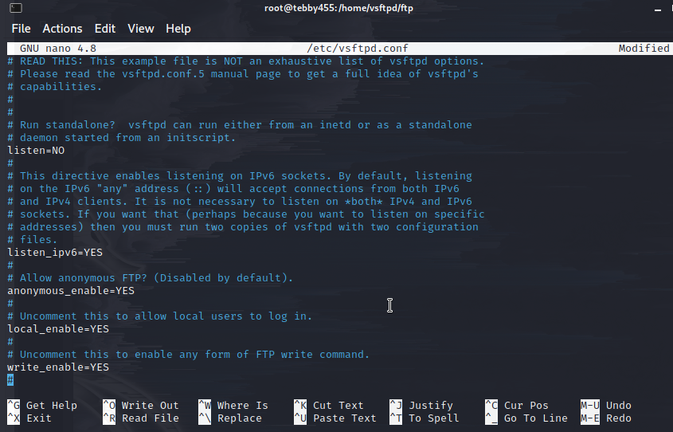
> edit _listen=YES, listen_ipv6=NO_

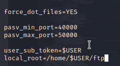
> Add these line in configure

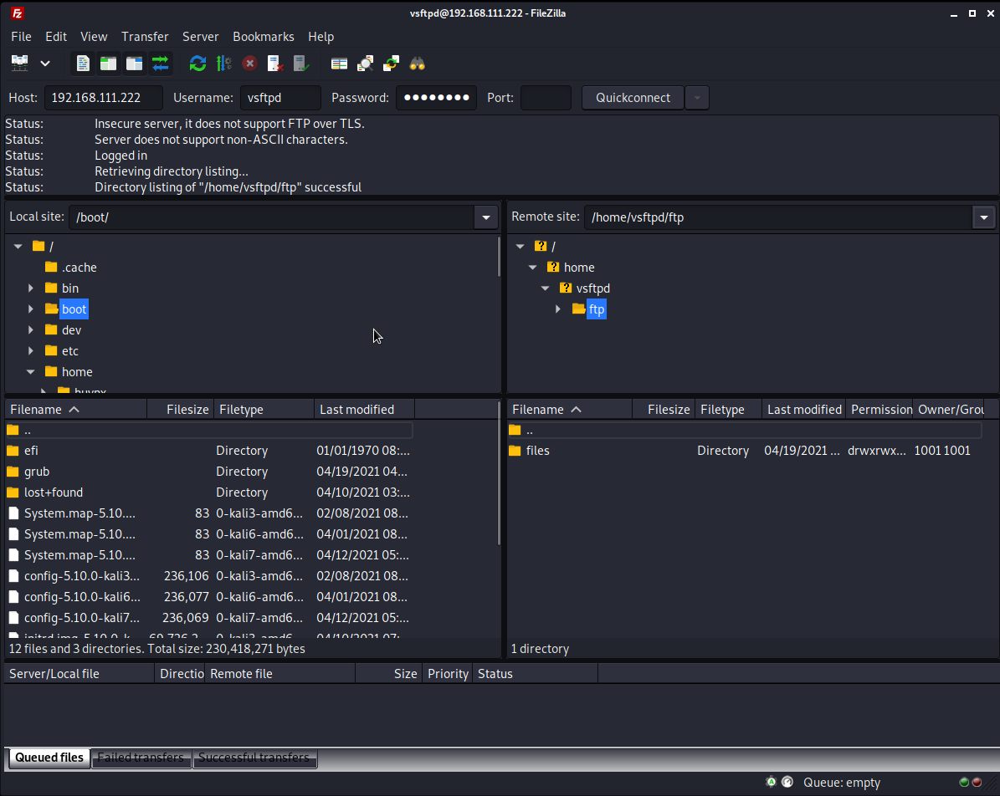
> Connected

### 4. ***phpmyadmin***

To Install `phpmyadmin`, we install these packages.

> apt-get install phpmyadmin php-mbstring php-gettext –y

> In _php_ version 7.0 to latest, php-gettext will be changed by _php-common_

> In apache2, while installing _phpmyadmin_ you can create database default by dkconfig-common
> Default database is _phpmyadmin_, password you set.

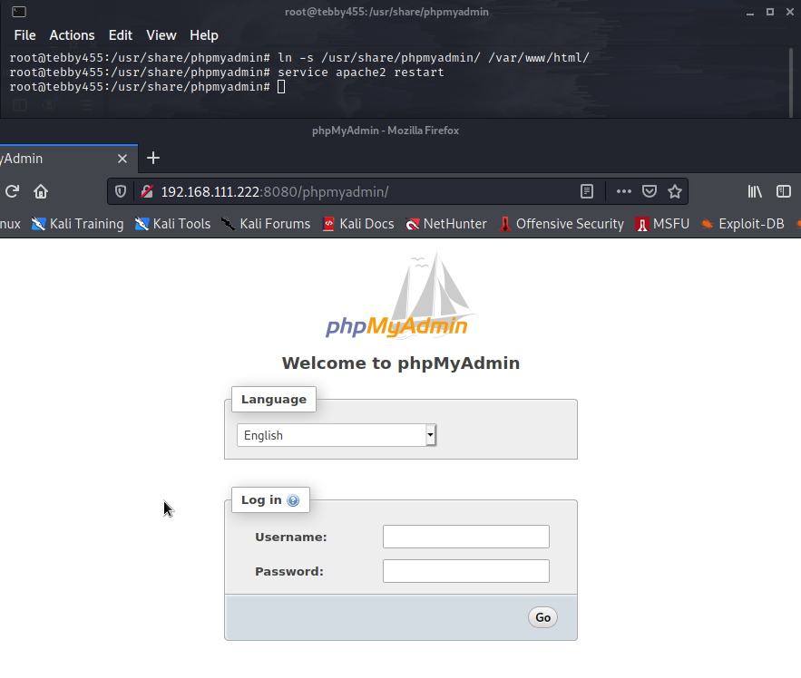
> Symbolic links _/usr/share/phpmyadmin/ /var/www/html_ if you run not found.

> Run it _[your IP]/phpmyadmin_

> login with your database and password

### 5. **Laravel** 

`apt install composer`

`apt install php libapache2-mod-php php-mbstring php-xmlrpc php-soap php-gd php-xml php-cli php-zip php-bcmath php-tokenizer php-json php-pear`

`composer create-project laravel/laravel {dirname}`

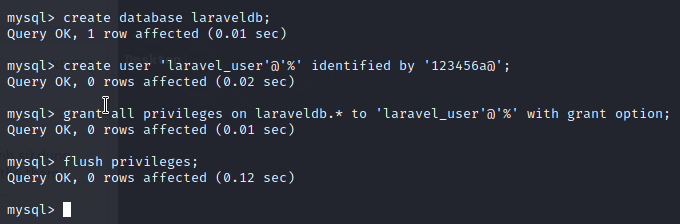
> setup database for _laravel_, in here i setup for anyone can remote access to this.

> create a file _laravel.conf_ in _/etc/apache2/sites-available/laravel.conf_ then enanle it by `a2ensite laravel.conf`
> Or you can symbolic link _laravel.conf_

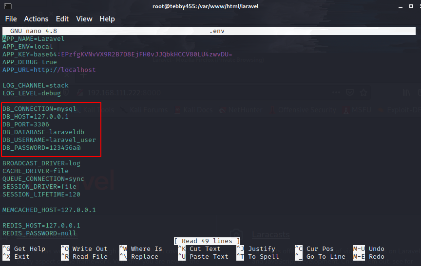
> Open file _/var/www/html/laravel/.env_ edit with your database

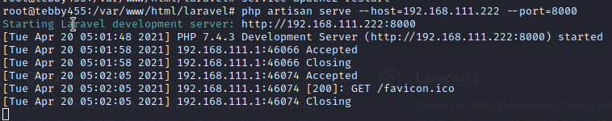
> Run command _php artisan serve --host=192.168.111.222 --port=8000_ before go to web.

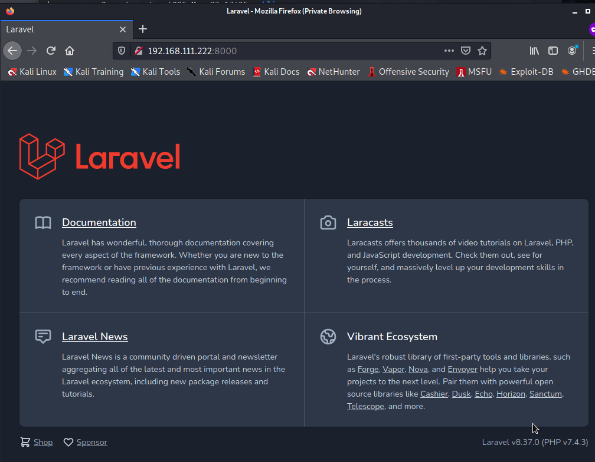
> Type _[IP]:port_