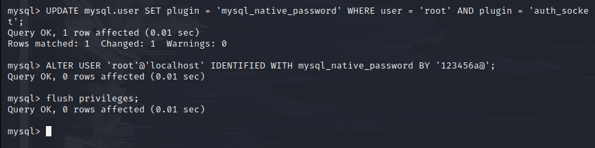
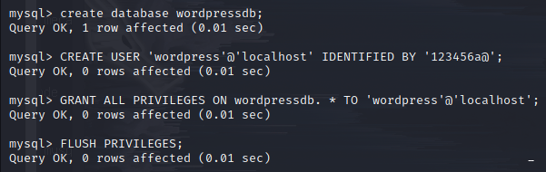
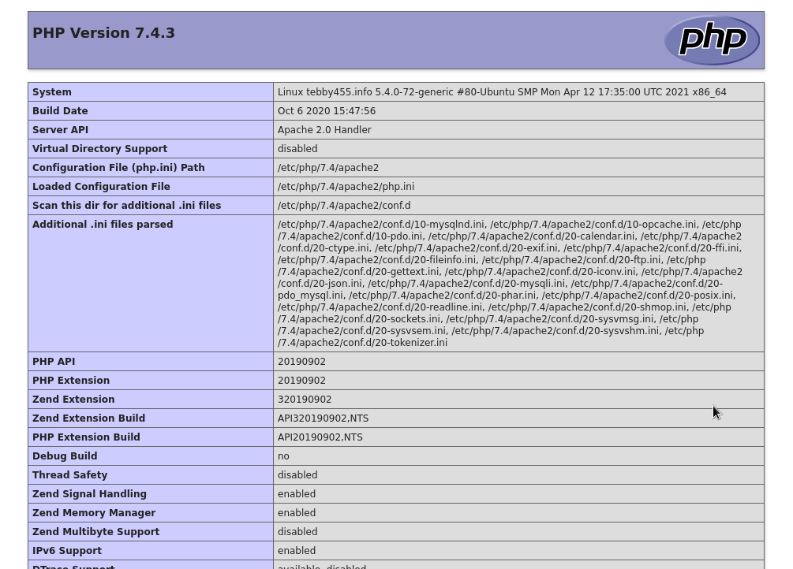
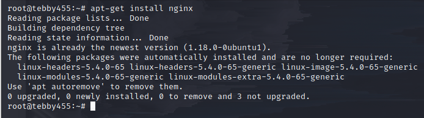
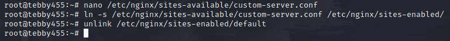

# Install LAMP Stack and LEMP Stack

**What is LAMP & LEMP**
**LAMP** and **LEMMP**based on

**L** stand for **Linux**
**A** stand for **Apache**, with **LEMP**, **E** stand for **Nginx**
**M** stand for **MySQL**, some system it uses **MariaDB**
**P** stand for **php**, some time nowadays it uses **perl**, **python**

- All of these combined into solution for web server more flexible.

## 1. LAMP Stack

a. **Apache2**
> apt-get install apache2 

b. **MySQL-Server**

c. **Configure MySQL-Server**

> login to mysql

> cahnge password for root, by default it is None

d. **Install Wordpress and setup**

> Download wordpress

> then unzip this file

> Fill Database and Username database like in picture

> Login with your IP, DNS, in here I log in with _tebby455.info/wordpress
> Register username, password, then here is success to log in

> Check apache by `<?php phpinfo(); ?>`

## 2. LEMP Stack

> _apt install php-fpm_ for support Nginx
> _service nginx start_ after installing

> link it into _/etc/nginx/sites-enabled/_

> Check php info again

> Success